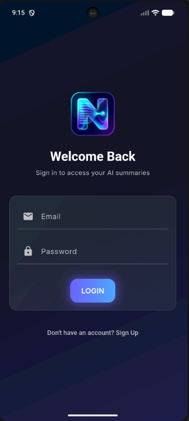
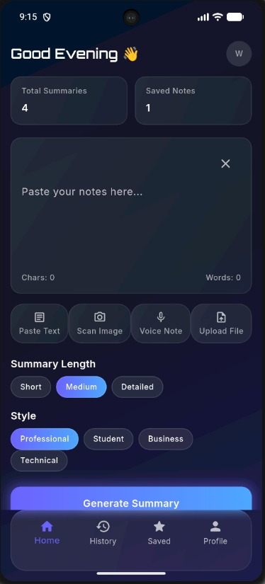
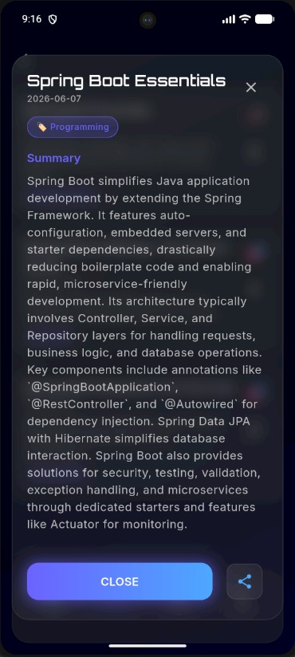
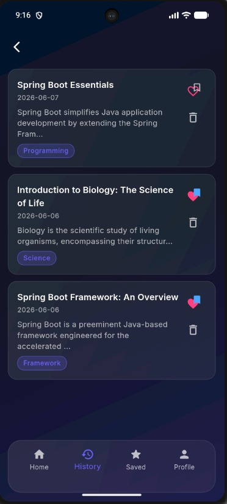
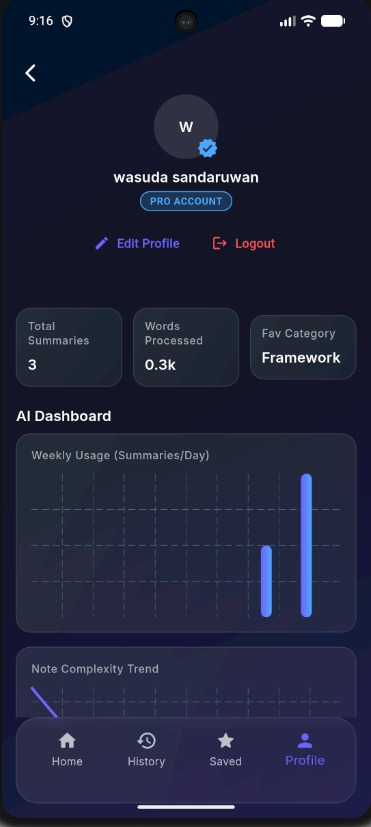

# NeuraBrief - AI Note Summarizer 🧠✨

NeuraBrief is a sophisticated, AI-powered mobile application built with Flutter that transforms lengthy notes into concise, actionable summaries. Featuring a stunning glassmorphism-inspired UI and seamless Firebase integration, NeuraBrief is designed for productivity enthusiasts who want to capture more in less time.

---

## 🚀 Features

- **AI summarization:** Leverages the power of Google Gemini (Generative AI) to distill information into clear, punchy summaries.
- **Glassmorphism UI:** A beautiful, modern interface with blurred backgrounds, glowing accents, and fluid animations.
- **Smart History:** Automatically tracks your summarization history with secure Firestore storage.
- **Favorites & Saved:** Bookmark your most important insights for quick access.
- **Secure Authentication:** Integrated with Firebase Auth for easy signup and login.
- **Interactive Dashboard:** Visualize your summarization trends using intuitive charts.
- **Seamless Sharing:** Share your summaries instantly with friends or colleagues.

---

## 📱 Screenshots

| Onboarding | Home | Summary | History | Profile |
| :---: | :---: | :---: | :---: | :---: |
|  |  |  |  |  |

---

## 🛠️ Tech Stack

- **Framework:** [Flutter](https://flutter.dev) (v3.3.0+)
- **Language:** Dart
- **AI Engine:** [Google Generative AI](https://pub.dev/packages/google_generative_ai) (Gemini)
- **Backend:** [Firebase](https://firebase.google.com) (Auth, Firestore)
- **State Management:** [Provider](https://pub.dev/packages/provider)
- **Animations:** [Flutter Animate](https://pub.dev/packages/flutter_animate), [Lottie](https://pub.dev/packages/lottie), [Animated Text Kit](https://pub.dev/packages/animated_text_kit)
- **UI Components:** Glassmorphism (Custom Widgets), Google Fonts, Lucide-like icons.
- **Data Visualization:** [FL Chart](https://pub.dev/packages/fl_chart)

---

## 🏁 Getting Started

### Prerequisites

- Flutter SDK installed on your machine.
- A Google Gemini API Key.
- A Firebase Project (Android/iOS configuration).

### Setup

1. **Clone the repository:**
   ```bash
   git clone https://github.com/your-username/neurabrief.git
   cd neurabrief
   ```

2. **Install dependencies:**
   ```bash
   flutter pub get
   ```

3. **Environment Variables:**
   Create a `.env` file in the root directory and add your API key:
   ```env
   GEMINI_API_KEY=your_gemini_api_key_here
   ```

4. **Firebase Configuration:**
   - Add your `google-services.json` (Android) and `GoogleService-Info.plist` (iOS) to the respective directories.
   - Alternatively, use [FlutterFire CLI](https://firebase.flutter.dev/docs/cli/) to configure.

5. **Run the app:**
   ```bash
   flutter run
   ```

---

## 📂 Project Structure

```text
lib/
├── core/             # Themes, constants, and utilities
├── models/           # Data models (Summary, User)
├── providers/        # State management logic
├── screens/          # UI Screens (Auth, Home, Summary, etc.)
├── services/         # API and Database interactions
└── widgets/          # Reusable UI components (GlassCard, GlowButton, etc.)
```

---

## 📄 License

This project is proprietary and confidential. All rights reserved. Unauthorized copying, distribution, or use of this project is strictly prohibited. See the [LICENSE](LICENSE) file for the full legal text.

---

<p align="center">Made with ❤️ for the Flutter Community</p>
